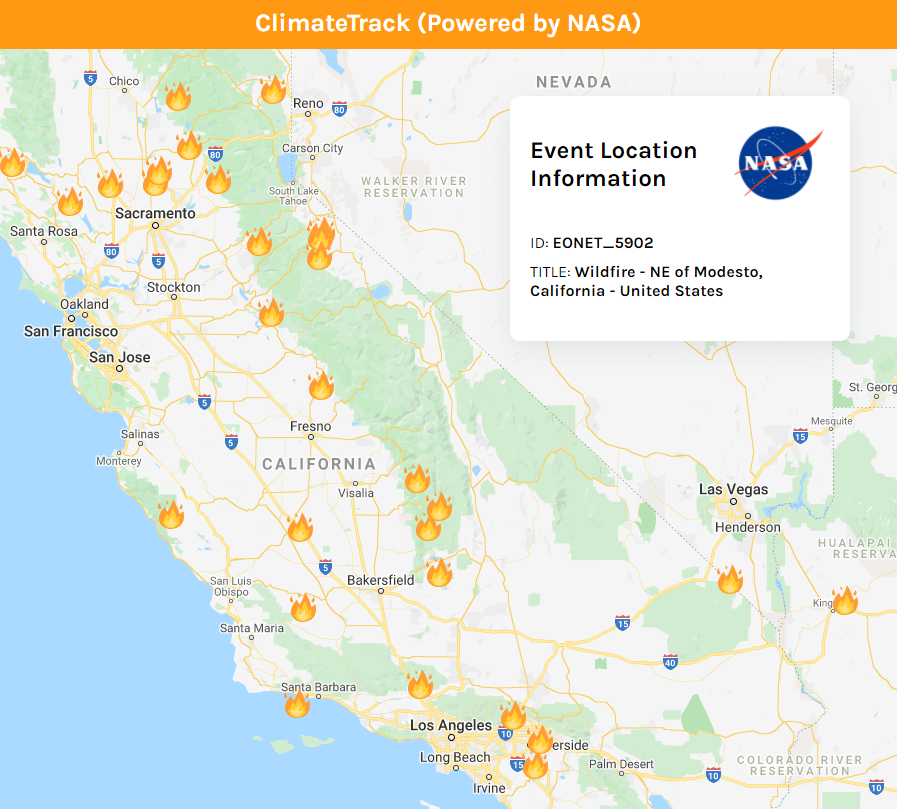

# ClimateTrack

In consideration of climate change and its global impacts, I developed a web app for tracking natural events including: wildfires, volcanoes, severe storms, and more. 

The web app was built using ```React``` and real-time data was fetched from the NASA EONET API. Natural event data was displayed on a map powered by Google Maps API. Within the app, users can click on location markers and gain event information through popup modals. 

This application can be proven to be useful as natural event data serves as an indication of our earth's everchanging climate. Below is an image capturing the California region surrounded by a handful of wildfires (indicated by the fire icons). 


